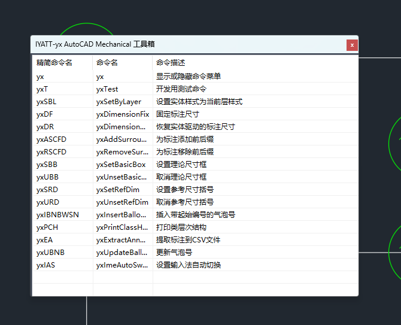

# CadTools

2026/3/16  
前年将 AutoCAD 用作工作时，我就简单研究了下 ObjectARX，本来想根据工作需要开发工具提升效率的，后面一直搁置了。最近几天又想起来，就开始动工了。  

2026/3/23  
补充说明：开发是面向 AutoCAD Mechanical （机械）版本，本插件在其它版本的 CAD 中可能无法使用。  

2026/4/12  
新增了可停靠的悬浮窗，支持双击执行对应命令。  

## 测试环境

软件：  
* Visual Studio 2022
* AutoCAD Mechanical 2026  
  
SDK：  
* ObjectARX SDK 2026  
* AutoCAD Mechanical SDK 2026  

编译标准：  
* C++20  

ObjectARX 环境配置参考：https://blog.iyatt.com/?p=21187  
AutoCAD Mechanical SDK 环境配置参考：https://blog.iyatt.com/?p=23776  

## 项目开发策略

紧跟最新版本的原则。  
本插件的定位是个人效率提升工具，当新版本 AutoCAD Mechanical 及 SDK 发布后，我将切换最新版进行测试。由于个人精力有限，不再针对旧版本进行维护。  

## 许可证

本项目采用 [MIT 许可证](LICENSE) 进行许可。  
